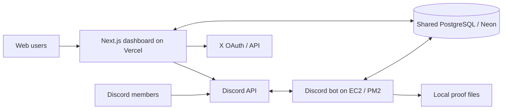

# KOS Architecture

Last verified against `main` on 2026-07-07.

## Product

KOS is a Discord-first whitelist raffle platform that is becoming a reusable
community-engagement platform. It currently supports multi-tenant organizations,
Discord and web raffle participation, reusable verification tasks, linked X
accounts, points, rewards, role-weighted draws, wallet collection, verifiable
draws, proof artifacts, and platform administration.

Phase 3 is delivered through S2.5 plus the first S3/S4 slices. Campaigns remain
planned but are not implemented.

## Runtime topology



- `apps/bot`: long-running Discord gateway process. It owns Discord
  interactions, scheduling, final draws, announcements, wallet DMs, and proof
  generation.
- `apps/dashboard`: Next.js 14 App Router application. It owns Discord OAuth,
  organization administration, member pages, signed-in community pages,
  anonymous public raffle pages, task verification, and web entry.
- `packages/db`: shared Prisma schema/client and migrations.
- PostgreSQL is the integration boundary between Vercel and the bot. Both must
  use the same `DATABASE_URL`.

The bot still exposes an authenticated localhost control API on port 4000, but
production dashboard actions no longer depend on it. Vercel queues publish,
edit, end, and reroll work in PostgreSQL; the bot scheduler consumes it.

## Repository layout

```text
apps/bot/             Discord bot, scheduler, raffle engine, proofs
apps/dashboard/       Next.js dashboard, APIs, organization and member UIs
packages/db/          Prisma schema, migrations, shared database client
scripts/              EC2 deployment helper
infra/nginx/          Legacy/all-in-one VPS reverse-proxy example
docs/                 Operating and engineering documentation
```

## Identity and authorization

Discord snowflakes are the global `User.id`. Discord OAuth writes encrypted
access/refresh tokens to `User` and issues a seven-day, HMAC-signed,
HTTP-only `kos_session` cookie.

The dashboard has three access levels:

1. Signed-in user: `/me`, web raffle entry, wallets, task completion.
2. Organization member/owner: `/:org/*`, guarded by `requireOrgAccess` and
   string permissions stored on `OrganizationRole`.
3. KOS super-admin: `/admin/*`, guarded by `User.isSuperAdmin`.

Tenant isolation is anchored by unique `GuildConnection.guildId`. Raffle-owned
data is scoped through the set of guild IDs connected to an organization.
Organization-native data such as tasks is scoped directly by
`organizationId`.

Middleware requires a valid session for every route except `/login`,
`/api/auth/*`, `/r/:id`, Next.js assets, and public icons. `/c/:slug` pages are
accessible without organization membership but still require a KOS session.
`/r/:id` is anonymous and server-rendered; its client entry panel calls the
authenticated `/api/me/raffles/:id` routes and offers Discord OAuth with a safe
same-page return when no session exists.

## Main data model

### Discord raffle domain

- `Guild`: Discord server configuration and manager roles.
- `User`: global Discord identity, OAuth credentials, super-admin flag.
- `Raffle`: schedule, status, channels, eligibility, wallet rules, draw proof,
  and database-mediated bot request fields.
- `RaffleRole`: eligible Discord roles with ANY/ALL semantics.
- `Participant`: unique `(raffleId, userId)` entry plus anti-alt snapshot.
- `Winner`: selected participant, position, reroll/replacement history.
- `WalletProfile`: reusable per-user/per-chain wallet registry.
- `Wallet`: optional raffle-specific winner wallet.
- `Blacklist`, `Log`, `Proof`: guild-scoped enforcement, audit, and artifacts.

### Multi-tenant platform

- `Organization`, `OrganizationMember`, `OrganizationRole`,
  `OrganizationInvite`, `GuildConnection`.
- `Organization.xHandle`: optional normalized public X branding handle.
- `Subscription`: FREE/PRO/SCALE scaffold; paid billing is not wired.
- `AuditLog`: organization audit trail.
- `Announcement`, `FeatureFlag`: super-admin platform controls.
- `SystemStatus`: service liveness key/value store; currently bot heartbeat.

### Phase 3 account and task domain

- `ConnectedAccount`: one external account per provider per KOS user; one
  provider identity cannot be shared between users. X is implemented;
  Telegram/GitHub are enum reservations.
- `TaskDefinition`: organization-owned reusable task.
- `TaskCompletion`: one user status/evidence record per task.
- `RaffleTask`: task-to-raffle gate.
- `Notification`: personal win/result/system notification. Announcements are
  merged at read time instead of copied per user.
- `PointsLedger`: append-only points awards/spends/refunds.
- `RoleWeight`: organization role multipliers for weighted raffles.
- `Reward`: organization reward catalog item.
- `RewardRedemption`: member reward claim.

There are no campaign/redemption-campaign models yet.

### Member community discovery

`/me/communities` refreshes the member's stored Discord OAuth token when
needed, reads `users/@me/guilds`, and compares those guild IDs with each
organization's unique `GuildConnection` rows. The member can switch between
their matching communities and the full non-suspended directory. Discord guild
icons are used when an organization has not uploaded a dedicated logo. A
failed membership lookup produces an explicit reconnect state, not an empty
membership claim.

## Raffle lifecycle and data flow

### Bot-created raffle

1. `/raffle create` opens a modal and an in-memory setup draft (15-minute TTL).
2. `createRaffle` writes LIVE or UPCOMING state and role/requirement data.
3. The bot posts the Discord embed, stores `messageId`, and ensures the raffle
   is connected to the tenant's Collab Hub.
4. The scheduler transitions UPCOMING to LIVE and LIVE to ENDED.

### Dashboard-created raffle

1. `POST /api/:org/raffles` validates tenant scope and writes status DRAFT.
2. The bot scheduler finds DRAFT rows with a channel, chooses LIVE/UPCOMING,
   and posts the embed.
3. A successful post automatically creates or reuses the matching active
   Collab Hub campaign; a failed post changes the raffle to CANCELLED and logs
   the reason without creating a CRM record.

Dashboard edits set `editRequestedAt`; end-now sets LIVE with `endAt = now`;
rerolls set `rerollRequest` and `rerollRequestedAt`. The scheduler clears and
processes those requests.

### Public sharing and duplication

- Every UPCOMING, LIVE, or ENDED raffle in a non-suspended organization has a
  canonical `/r/:id` page with SSR metadata, Open Graph/Twitter banner data,
  public requirements, and no admin controls.
- Raffle IDs are validated as positive PostgreSQL integers. Share-link helpers
  normalize the configured HTTP(S) origin and use the stable global raffle ID;
  clipboard actions have a manual-copy fallback.
- Public organization identity is derived from the raffle guild's unique
  `GuildConnection`. The legacy `/c/:slug/raffles/:id` page verifies that
  relationship and permanently redirects to the canonical page.
- `GET /api/:org/raffles/:id/duplicate` returns a permission-checked editable
  blueprint. `POST` creates a fresh `DRAFT` from source configuration plus
  reviewed overrides and preserves raw custom requirement fields.
- Both duplicate endpoints query the source by raffle ID plus the requesting
  organization's connected guild IDs. The client cannot select a different
  organization or guild for the clone.
- Duplication never copies participants, winners, entry counts, Discord message
  IDs, proof/draw state, created dates, or analytics. The bot publishes the new
  draft through the standard database scheduler flow.

### Entry

Discord and web entry write the same `Participant` table and maintain
`Raffle.entryCount` transactionally.

Both paths enforce blacklist, guild membership, eligible roles, additional
roles, account/server age, wallet requirements, and verified `RaffleTask`s.
Discord additionally checks reaction requirements; the web detects these and
requires entry from Discord. The bot auto-verifies same-guild Discord tasks
inline. The web verifies guild membership/roles through Discord REST using the
bot token.

### Draw and proof

1. The bot filters entered users who are not currently blacklisted.
2. It creates a 32-byte random seed and SHA-256 commitment.
3. Each candidate is ranked by `HMAC-SHA256(seed, userId)`; the first N win.
4. The transaction stores ENDED state, the seed/commitment, and winners.
5. Discord announcements, web notifications, wallet DMs, and PDF/CSV/PNG
   proof generation follow.

Rerolls use a new seed but do not persist that reroll seed or commitment. They
mark replaced winners, add replacements, notify replacements, and regenerate
the proof from the raffle's original commitment.

## Task Verification Engine

`verifyTask` dispatches by `TaskType`:

- X follow/like/repost/comment: requires linked X identity, then records a
  link-and-attest VERIFIED result. No real engagement API check is made.
- Discord join/role: real Discord REST membership/role check when the bot token
  is available; otherwise NEEDS_REVIEW.
- Visit link: click-and-attest VERIFIED.
- Manual: NEEDS_REVIEW for organization approval/rejection.

Task completion evidence is stored as JSON. Organization task CRUD and review
APIs use existing organization permissions. Task points are awarded once per
`(organizationId, userId, taskId)` through the append-only `PointsLedger`.

## Points and rewards

Balances are computed as `SUM(PointsLedger.delta)` per organization/user.
Positive task rows use `sourceType = TASK`; reward claims spend points with
negative `REWARD_REDEEM` rows; rejected/cancelled pending reward claims refund
with positive `REWARD_REFUND` rows.

Each connected `Guild` can set `defaultPointsChannelId`. Web and Discord task
awards plus reward redemptions post best-effort activity updates to that
channel when configured.

Web surfaces:

- `/:org/points`: leaderboard, recent awards, points-channel configuration.
- `/me/points`: member balances/recent awards.
- `/:org/rewards`: reward catalog and redemption fulfillment/refund queue.
- `/me/rewards`: member reward store and personal redemption history.

Discord surfaces:

- `/points balance`, `/points leaderboard`, `/points panel`.
- `/tasks list`, `/tasks verify`.
- `/rewards list`, `/rewards redeem`, `/rewards mine`.
- Manager-only `/rewards create`, `/rewards fulfill`, `/rewards cancel`.

## Wallets and encryption

Ethereum/Base, Solana, and Bitcoin addresses receive format-only validation.
`WalletProfile` is shared between Discord and web. Winner exports prefer a
raffle-specific `Wallet`, then fall back to a matching reusable profile.

OAuth tokens and wallet addresses use AES-256-GCM with
`WALLET_ENCRYPTION_KEY`. If the key is absent, current helpers permit plaintext
storage for development. Bot and dashboard must share the same key.

## Phase 4 Collab Hub

Collab Hub is an organization-native whitelist collaboration CRM at
`/:org/collabs`. It has three operational projections over the same records:
a drag-and-drop pipeline board, a sortable/filterable spreadsheet, and a
deadline/reminder calendar. The landing workspace also returns global summary
metrics, recent activity/notes, deadlines, saved filters, partner performance,
team performance, and all-time monthly activity from the first record through
the current month.

The tenant root is `Collaboration.organizationId`. Durable relationship data
belongs to `CollaborationPartner`; each pipeline record snapshots its working
project name, assignment, allocation, requirements, priority, dates, and
status. Contacts belong to a partner and can be scoped to a collaboration.
Notes, comments, files, activities, reminders, tags, and saved filters are
organization-private collaboration data.

`CollaborationRaffle` attaches one existing raffle to at most one
collaboration. The dashboard validates both the collaboration's
`organizationId` and the raffle's connected `guildId`. Creating a raffle from
Collab Hub passes `collaborationId` through the existing dashboard raffle
builder, writes the normal DRAFT raffle, and attaches it without duplicating
entry/draw data.

Successful Discord publication is also an automatic Collab Hub boundary. The
bot resolves the organization from the raffle guild, matches a partner by
normalized project identity or project X URL, reuses an active campaign when
available, and otherwise creates a new Scheduled/Hosting collaboration. The
publish hook writes the source link immediately; the minute automation sweep
retries any published UPCOMING/LIVE/ENDED row that remains unlinked. Terminal
relationships stay historical, so a later campaign for the same partner gets a
new collaboration instead of reopening an accepted/submitted record.

`GET /api/:org/collaborations/import-history` previews the tenant's unlinked
ended/cancelled archive and classifies standard, empty, cancelled, and
test-named records. `POST` applies the selected policy; standard ended records
remain the default, while exceptional categories require explicit opt-in. GTD
and FCFS variants attach to one completed collaboration; older unlabeled rounds
paired with explicit FCFS are inferred as GTD. Empty/cancelled attempts do not
increase allocation, cancelled-only groups stay cancelled, and the importer
leaves participant, winner, proof, and encrypted wallet sources in their
existing tables.

`CollaborationWallet` stores only per-user workflow state (`WAITING`,
`COLLECTED`, `SUBMITTED`, or `REJECTED`) plus a winner reference and detected
chain. It never copies wallet addresses. Permission-checked CSV/XLSX/TXT
exports resolve the existing encrypted winner wallet or reusable wallet
profile, decrypt it in the server response, then mark the exported rows and
collaboration submitted.

Manual wallet-list import accepts CSV/TXT data but does not create a second
wallet registry. Each row must identify an existing KOS user and exactly match
that user's registered encrypted `WalletProfile` for the selected chain.
Accepted rows only create/update `CollaborationWallet` workflow state;
conflicts are rejected with row-level feedback and addresses are excluded from
activity/audit metadata.

Collaboration notes use sanitized rich HTML with an allowlisted visual editor.
Attachments upload directly to private Vercel Blob objects with short-lived,
path-restricted tokens. The detail API omits raw Blob URLs and authorized file
reads stream through the collaboration attachment route. Generated proof
PDF/CSV/PNG buffers are base64 encoded, AES-256-GCM encrypted with the shared
wallet key, and copied into nullable `Proof` byte columns. Bot-local paths
remain for cleanup; authorized Collab Hub routes serve the portable encrypted
copies. A bounded bot backfill covers older artifacts and regenerates them from
raffle/winner data without reposting when a legacy absolute path is missing.

The bot scheduler auto-links missed hosted raffles and sweeps active
collaborations once per minute. A durable
`SystemStatus` keyset cursor continues active-record batches across ticks, and
due reminders drain in bounded batches under a per-sweep time budget. Raffle draws
and the sweep reconcile winners/wallet profiles, move records to Hosting,
Collecting wallets, or Ready for submission, and deliver due reminder/inactive
notifications to the organization owner plus active members with
`collab:view`. Manual status changes remain available in the dashboard.

Collab Hub permissions are `collab:view`, `collab:create`, `collab:edit`,
`collab:assign`, `collab:export`, and `collab:archive`. Owners bypass explicit
permission strings; the Phase 4 migration grants expected access to existing
Admin, Moderator, Collab Manager, and Viewer system roles without changing
custom roles.

The same collaboration records have breakpoint-specific projections. Desktop
uses the draggable horizontal board and month grid; mobile uses status-grouped
cards and an agenda so neither requires a forced wide canvas. The mobile filter
bar participates in normal document flow, and its advanced controls expand on
demand.

`Collaboration.ownerId` is the persisted compatibility field for the
collaboration's hosting admin. Collab Hub APIs expose active organization
members as the assignment team; organization ownership alone does not add
someone to that list. Historical imports derive this field from the attached
raffles' `createdById`. If a grouped campaign has multiple hosts, the importer
chooses the admin with the most rounds, then the admin on the most recently
created round.

Partner identity media and raffle campaign media remain separate. A partner
logo is an explicitly supplied `CollaborationPartner.logoUrl`; historical
imports do not promote `Raffle.bannerUrl` into that field. Attached raffle
cards display the banner in a contained 16:9 frame and fall back to a branded
project treatment when the source is absent or expired.

New Discord-uploaded raffle banners cross a durable-media boundary before
publication. The bot accepts only Discord attachment hosts and supported image
types, reads at most 5 MB, stores the bytes in the one-to-one
`RaffleBannerAsset`, and changes `Raffle.bannerUrl` to a versioned
`/r/:id/banner` URL. The public route serves the immutable copy to Discord and
the dashboard. Dashboard-originated uploads continue to use Vercel Blob; the
40 already-expired historical attachment URLs cannot be reconstructed.

The Hub reports relationship cards and source raffles as distinct totals.
Repeated GTD/FCFS rounds can share one collaboration, while the organization
Raffles page remains the one-row-per-raffle archive.

## Deployment

- Dashboard: Vercel, rooted at `apps/dashboard`; pushes to `main` trigger
  deployment. The primary production origin is `https://raffle.koslabs.app`.
- Bot: EC2 under PM2 as `kos-bot`; `scripts/deploy-ec2.sh` rsyncs code, builds
  DB/bot, registers slash commands, restarts PM2, and checks localhost health.
- Database: shared managed PostgreSQL/Neon. Migrations are additive Prisma SQL
  migrations under `packages/db/prisma/migrations`.
- Proof files: generated on the bot host under `PROOF_OUTPUT_DIR`, posted to
  Discord, and copied in encrypted form to PostgreSQL for tenant-authorized
  dashboard downloads. The dashboard never attempts to read EC2-local paths.

## Verification posture

Vitest covers public raffle policy, duplicate scheduling/variants, and the
duplicate API's tenant boundary. Additional safety nets are strict TypeScript,
Prisma schema validation, package builds, database constraints, and production
smoke checks. Playwright now covers the authenticated Communities directory and
organization Branding/X form on desktop and mobile, including committed visual
baselines. Its global setup signs a short-lived ordinary session from external
credentials and never adds a test authentication route. Draws, full eligibility
parity, and broader Discord workflows still need automated browser coverage.
An authenticated production smoke test also covers the Collab Hub landing
page, creation panel, mobile navigation, responsive overflow, and browser
console. It is intentionally non-mutating; the recommended next acceptance
pass in `docs/HANDOFF.md` exercises a controlled real collaboration lifecycle.
See `docs/HANDOFF.md` for the latest verified commands and known gaps.
