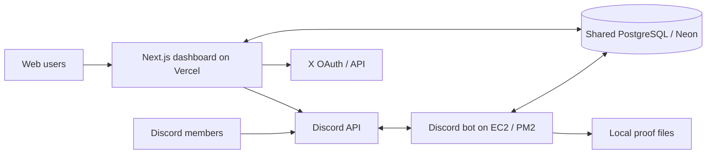

# KOS Architecture

Last verified against `main` on 2026-07-07.

## Product

KOS is a Discord-first whitelist raffle platform that is becoming a reusable
community-engagement platform. It currently supports multi-tenant organizations,
Discord and web raffle participation, reusable verification tasks, linked X
accounts, points, rewards, role-weighted draws, wallet collection, verifiable
draws, proof artifacts, and platform administration.

Phase 3 is delivered through S2.5 plus the first S3/S4 slices. Campaigns remain
planned but are not implemented.

## Runtime topology



- `apps/bot`: long-running Discord gateway process. It owns Discord
  interactions, scheduling, final draws, announcements, wallet DMs, and proof
  generation.
- `apps/dashboard`: Next.js 14 App Router application. It owns Discord OAuth,
  organization administration, member pages, public-with-login community
  pages, task verification, and web entry.
- `packages/db`: shared Prisma schema/client and migrations.
- PostgreSQL is the integration boundary between Vercel and the bot. Both must
  use the same `DATABASE_URL`.

The bot still exposes an authenticated localhost control API on port 4000, but
production dashboard actions no longer depend on it. Vercel queues publish,
edit, end, and reroll work in PostgreSQL; the bot scheduler consumes it.

## Repository layout

```text
apps/bot/             Discord bot, scheduler, raffle engine, proofs
apps/dashboard/       Next.js dashboard, APIs, organization and member UIs
packages/db/          Prisma schema, migrations, shared database client
scripts/              EC2 deployment helper
infra/nginx/          Legacy/all-in-one VPS reverse-proxy example
docs/                 Operating and engineering documentation
```

## Identity and authorization

Discord snowflakes are the global `User.id`. Discord OAuth writes encrypted
access/refresh tokens to `User` and issues a seven-day, HMAC-signed,
HTTP-only `kos_session` cookie.

The dashboard has three access levels:

1. Signed-in user: `/me`, web raffle entry, wallets, task completion.
2. Organization member/owner: `/:org/*`, guarded by `requireOrgAccess` and
   string permissions stored on `OrganizationRole`.
3. KOS super-admin: `/admin/*`, guarded by `User.isSuperAdmin`.

Tenant isolation is anchored by unique `GuildConnection.guildId`. Raffle-owned
data is scoped through the set of guild IDs connected to an organization.
Organization-native data such as tasks is scoped directly by
`organizationId`.

Middleware requires a valid session for every route except `/login`,
`/api/auth/*`, Next.js assets, and the favicon. Consequently `/c/:slug` pages
are accessible without organization membership but are not anonymous public
pages.

## Main data model

### Discord raffle domain

- `Guild`: Discord server configuration and manager roles.
- `User`: global Discord identity, OAuth credentials, super-admin flag.
- `Raffle`: schedule, status, channels, eligibility, wallet rules, draw proof,
  and database-mediated bot request fields.
- `RaffleRole`: eligible Discord roles with ANY/ALL semantics.
- `Participant`: unique `(raffleId, userId)` entry plus anti-alt snapshot.
- `Winner`: selected participant, position, reroll/replacement history.
- `WalletProfile`: reusable per-user/per-chain wallet registry.
- `Wallet`: optional raffle-specific winner wallet.
- `Blacklist`, `Log`, `Proof`: guild-scoped enforcement, audit, and artifacts.

### Multi-tenant platform

- `Organization`, `OrganizationMember`, `OrganizationRole`,
  `OrganizationInvite`, `GuildConnection`.
- `Subscription`: FREE/PRO/SCALE scaffold; paid billing is not wired.
- `AuditLog`: organization audit trail.
- `Announcement`, `FeatureFlag`: super-admin platform controls.
- `SystemStatus`: service liveness key/value store; currently bot heartbeat.

### Phase 3 account and task domain

- `ConnectedAccount`: one external account per provider per KOS user; one
  provider identity cannot be shared between users. X is implemented;
  Telegram/GitHub are enum reservations.
- `TaskDefinition`: organization-owned reusable task.
- `TaskCompletion`: one user status/evidence record per task.
- `RaffleTask`: task-to-raffle gate.
- `Notification`: personal win/result/system notification. Announcements are
  merged at read time instead of copied per user.
- `PointsLedger`: append-only points awards/spends/refunds.
- `RoleWeight`: organization role multipliers for weighted raffles.
- `Reward`: organization reward catalog item.
- `RewardRedemption`: member reward claim.

There are no campaign/redemption-campaign models yet.

## Raffle lifecycle and data flow

### Bot-created raffle

1. `/raffle create` opens a modal and an in-memory setup draft (15-minute TTL).
2. `createRaffle` writes LIVE or UPCOMING state and role/requirement data.
3. The bot posts the Discord embed and stores `messageId`.
4. The scheduler transitions UPCOMING to LIVE and LIVE to ENDED.

### Dashboard-created raffle

1. `POST /api/:org/raffles` validates tenant scope and writes status DRAFT.
2. The bot scheduler finds DRAFT rows with a channel, chooses LIVE/UPCOMING,
   and posts the embed.
3. A failed Discord post changes the raffle to CANCELLED and logs the reason.

Dashboard edits set `editRequestedAt`; end-now sets LIVE with `endAt = now`;
rerolls set `rerollRequest` and `rerollRequestedAt`. The scheduler clears and
processes those requests.

### Entry

Discord and web entry write the same `Participant` table and maintain
`Raffle.entryCount` transactionally.

Both paths enforce blacklist, guild membership, eligible roles, additional
roles, account/server age, wallet requirements, and verified `RaffleTask`s.
Discord additionally checks reaction requirements; the web detects these and
requires entry from Discord. The bot auto-verifies same-guild Discord tasks
inline. The web verifies guild membership/roles through Discord REST using the
bot token.

### Draw and proof

1. The bot filters entered users who are not currently blacklisted.
2. It creates a 32-byte random seed and SHA-256 commitment.
3. Each candidate is ranked by `HMAC-SHA256(seed, userId)`; the first N win.
4. The transaction stores ENDED state, the seed/commitment, and winners.
5. Discord announcements, web notifications, wallet DMs, and PDF/CSV/PNG
   proof generation follow.

Rerolls use a new seed but do not persist that reroll seed or commitment. They
mark replaced winners, add replacements, notify replacements, and regenerate
the proof from the raffle's original commitment.

## Task Verification Engine

`verifyTask` dispatches by `TaskType`:

- X follow/like/repost/comment: requires linked X identity, then records a
  link-and-attest VERIFIED result. No real engagement API check is made.
- Discord join/role: real Discord REST membership/role check when the bot token
  is available; otherwise NEEDS_REVIEW.
- Visit link: click-and-attest VERIFIED.
- Manual: NEEDS_REVIEW for organization approval/rejection.

Task completion evidence is stored as JSON. Organization task CRUD and review
APIs use existing organization permissions. Task points are awarded once per
`(organizationId, userId, taskId)` through the append-only `PointsLedger`.

## Points and rewards

Balances are computed as `SUM(PointsLedger.delta)` per organization/user.
Positive task rows use `sourceType = TASK`; reward claims spend points with
negative `REWARD_REDEEM` rows; rejected/cancelled pending reward claims refund
with positive `REWARD_REFUND` rows.

Each connected `Guild` can set `defaultPointsChannelId`. Web and Discord task
awards plus reward redemptions post best-effort activity updates to that
channel when configured.

Web surfaces:

- `/:org/points`: leaderboard, recent awards, points-channel configuration.
- `/me/points`: member balances/recent awards.
- `/:org/rewards`: reward catalog and redemption fulfillment/refund queue.
- `/me/rewards`: member reward store and personal redemption history.

Discord surfaces:

- `/points balance`, `/points leaderboard`, `/points panel`.
- `/tasks list`, `/tasks verify`.
- `/rewards list`, `/rewards redeem`, `/rewards mine`.
- Manager-only `/rewards create`, `/rewards fulfill`, `/rewards cancel`.

## Wallets and encryption

Ethereum/Base, Solana, and Bitcoin addresses receive format-only validation.
`WalletProfile` is shared between Discord and web. Winner exports prefer a
raffle-specific `Wallet`, then fall back to a matching reusable profile.

OAuth tokens and wallet addresses use AES-256-GCM with
`WALLET_ENCRYPTION_KEY`. If the key is absent, current helpers permit plaintext
storage for development. Bot and dashboard must share the same key.

## Deployment

- Dashboard: Vercel, rooted at `apps/dashboard`; pushes to `main` trigger
  deployment.
- Bot: EC2 under PM2 as `kos-bot`; `scripts/deploy-ec2.sh` rsyncs code, builds
  DB/bot, registers slash commands, restarts PM2, and checks localhost health.
- Database: shared managed PostgreSQL/Neon. Migrations are additive Prisma SQL
  migrations under `packages/db/prisma/migrations`.
- Proof files: generated on the bot host under `PROOF_OUTPUT_DIR` and posted to
  Discord. The dashboard does not serve those local paths.

## Verification posture

There is no automated test suite. Current safety nets are strict TypeScript,
Prisma schema validation, package builds, database constraints, and production
smoke checks. See `docs/HANDOFF.md` for the latest verified commands and known
gaps.
